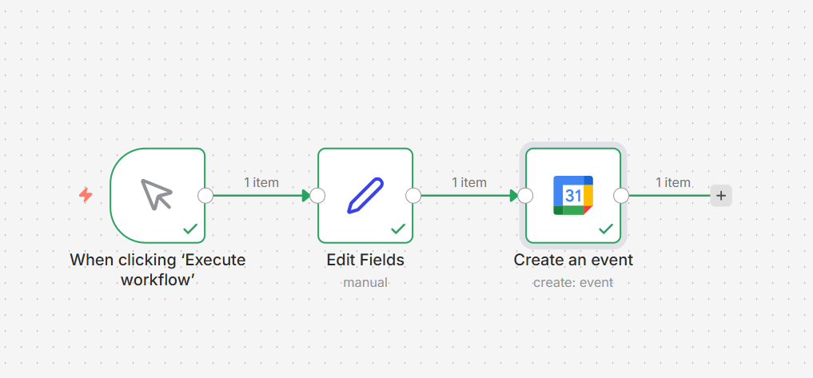
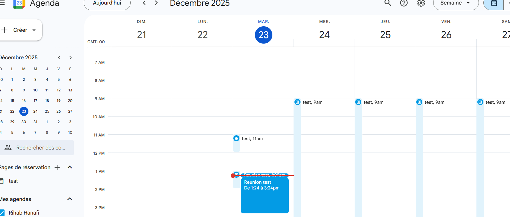

# n8n Workflow – Google Calendar Automation

## Description
Ce workflow n8n permet de créer automatiquement des événements dans Google Calendar.  
Idéal pour automatiser ton agenda personnel ou professionnel.

---

## Fonctionnement

1. **Manual Trigger**  
   Déclenche le workflow manuellement (ou remplacer par Schedule Trigger pour automatisation quotidienne).

2. **Edit Fields**  
   Définit les informations de l’événement :
   - `Summary` : Titre de l’événement
   - `Start` : Date et heure de début
   - `End` : Date et heure de fin

3. **Google Calendar (Event → Create)**  
   Crée l’événement dans l’agenda choisi (via ID de l’agenda Google).

---

## Installation

1. Exporter le workflow depuis n8n (`.json`)  
2. Cloner ce repo ou copier le fichier `.json`  
3. Dans n8n : **Import** → sélectionner le fichier `.json`  
4. Créer / connecter le **credential Google Calendar**  
5. Exécuter le workflow

---

## Prérequis

- Compte Google avec Google Calendar  
- n8n installé (desktop, cloud ou docker)  
- Node.js et Git si utilisation de ce repo localement  

---

## Screenshots

### Workflow complet

### Node Google Calendar

---

## Notes importantes

- Les **credentials Google** ne sont pas inclus dans le workflow exporté pour des raisons de sécurité.  
- Pour automatiser complètement (sans bouton), remplacer le **Manual Trigger** par un **Schedule Trigger**.
